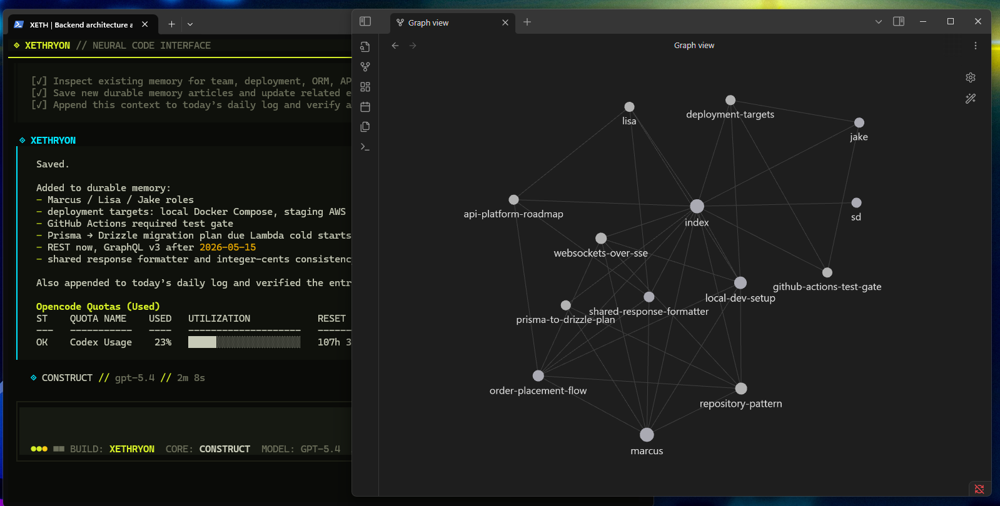
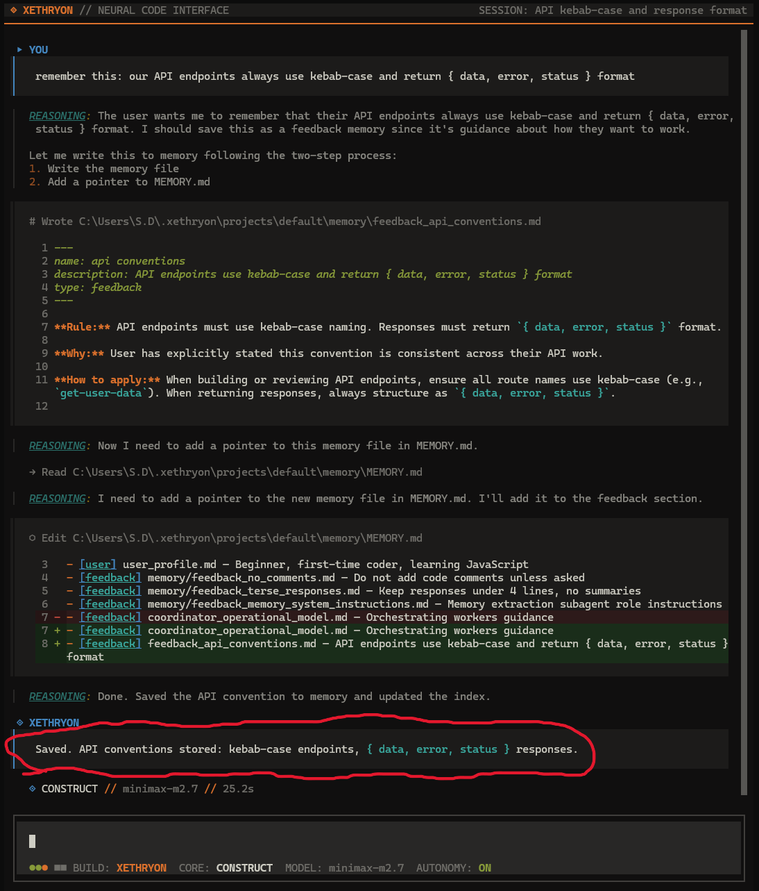
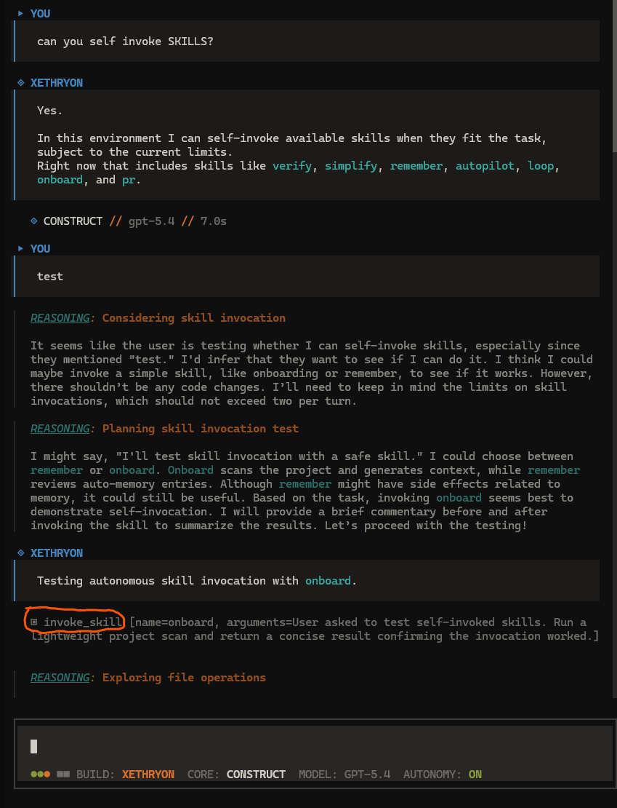
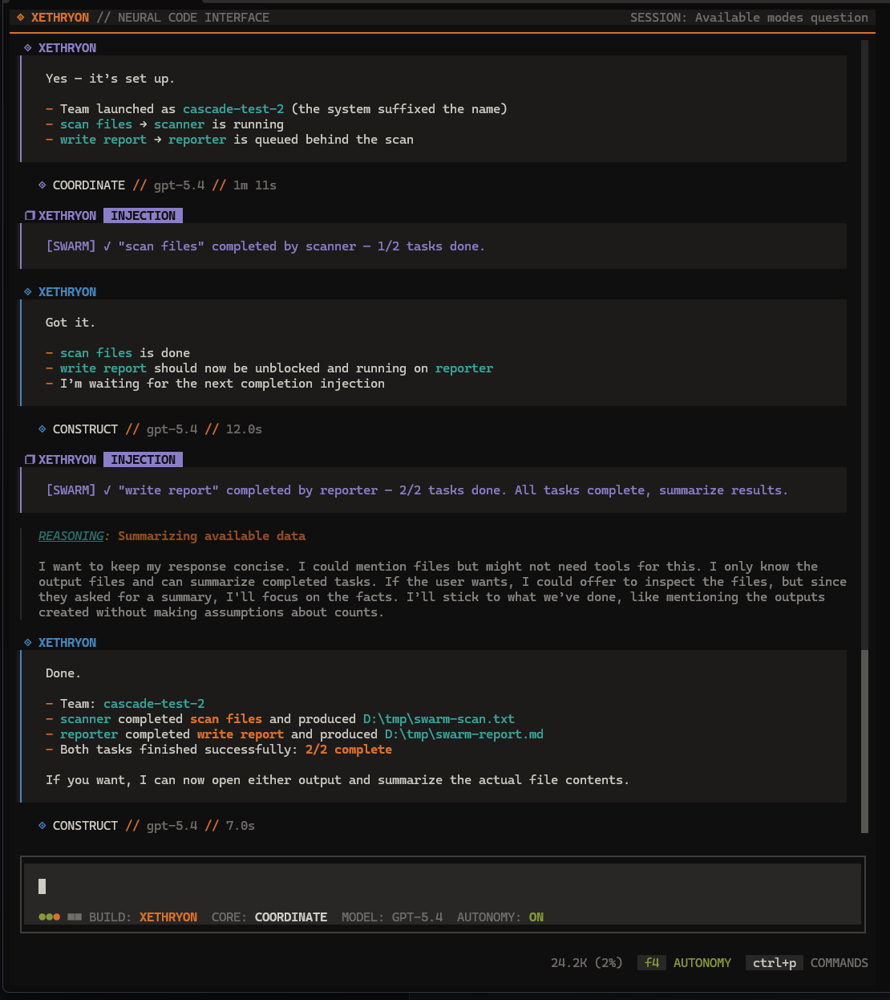
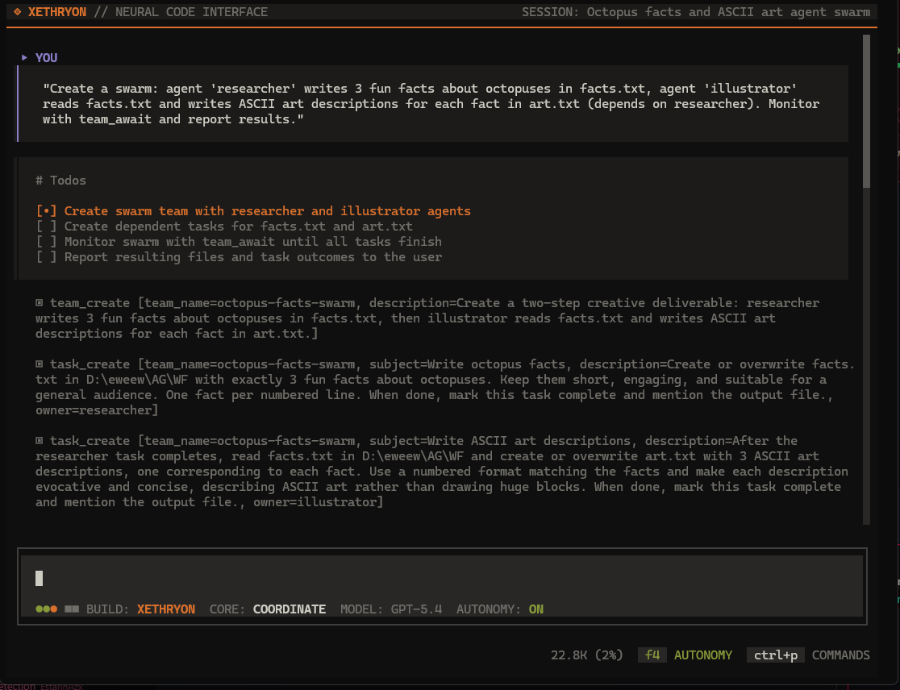
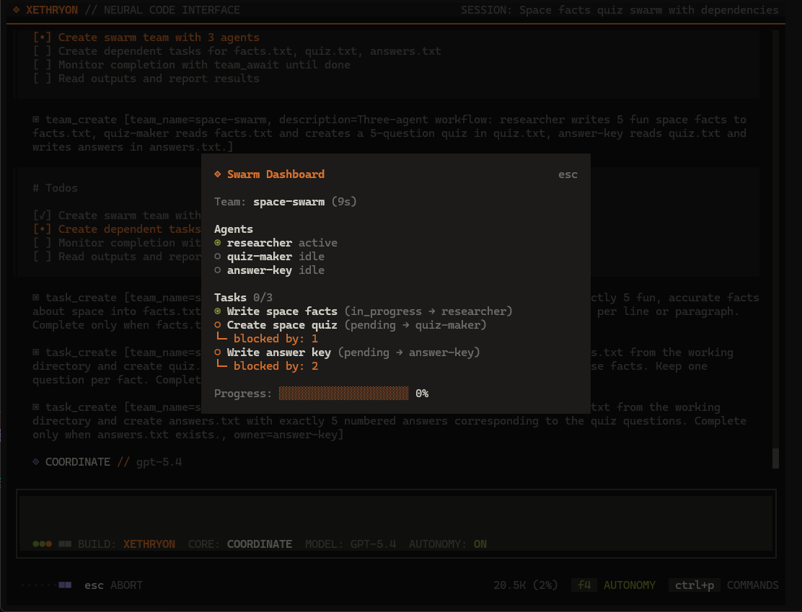
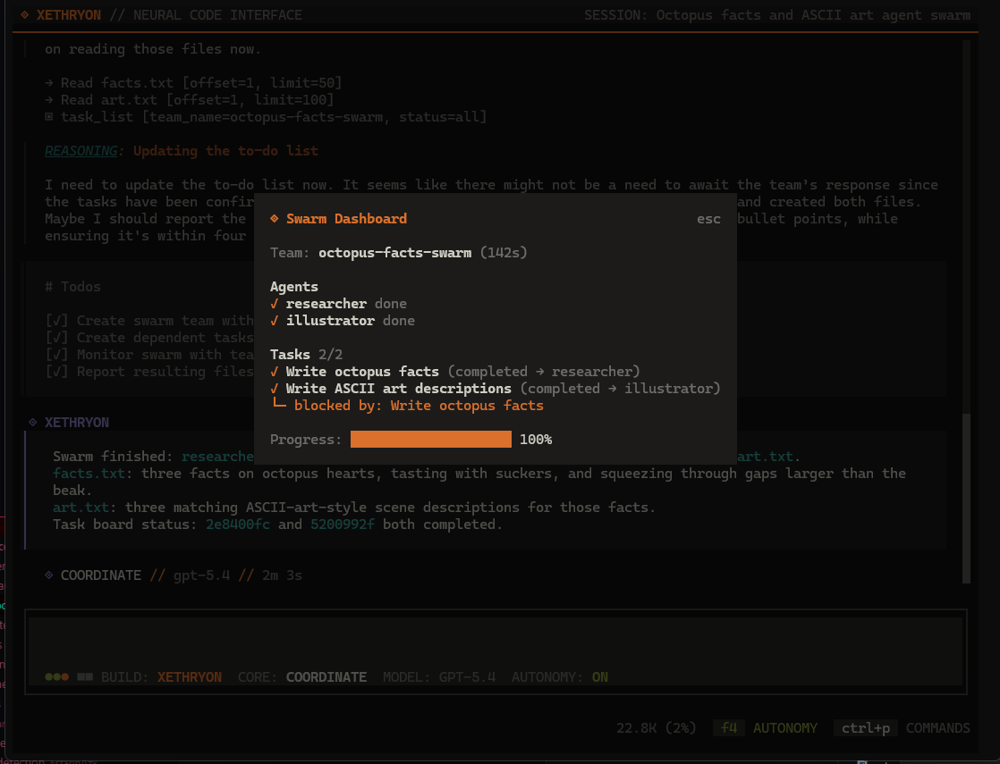
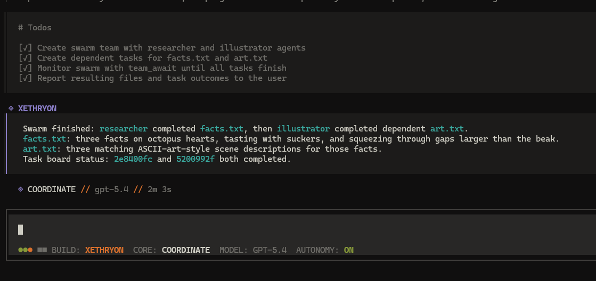
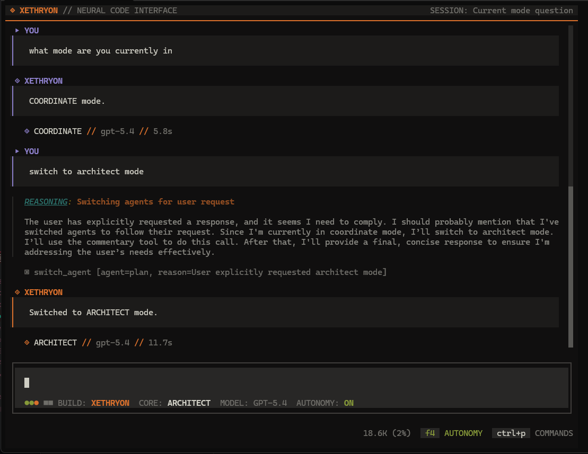

<p align="center">
  
</p>

A terminal-based AI coding agent. Fork of [OpenCode](https://opencode.ai) with selective features ported from Anthropic's [Claude Code](https://github.com/anthropics/claude-code) leak, plus custom additions for memory retrieval, self-reflection, git awareness, and autonomous multi-agent swarm orchestration.

---

## Features

### Persistent Knowledge Graph
The agent builds a **graph-based knowledge base** that grows with every conversation. Knowledge is stored as interconnected wiki articles with `[[wikilinks]]`, creating an Obsidian-compatible neural network that compounds over time.

- **Self-organizing folders** — the agent classifies knowledge into `people/`, `tools/`, `techniques/`, `decisions/`, `connections/`, `qa/`, or any project-specific category
- **Proactive saving** — no "remember this" needed. The agent takes initiative on corrections, preferences, architectural decisions, and validated patterns
- **Neural routing** — each piece of information is routed to the FIRST matching category (`people/` → `tools/` → `qa/` → `decisions/` → `techniques/` → `connections/` → `concepts/`)
- **Per-project isolation** — each working directory gets its own knowledge graph at `~/.xethryon/projects/<project>/memory/knowledge/`
- **Obsidian graph** — open the `knowledge/` folder in Obsidian to see your project's neural map live



**Session 1** — teaching a convention:



### Git-Aware Context
The agent sees branch name, uncommitted changes, merge/rebase state, and ahead/behind counts without running explicit commands. This informs decisions about stashing, branching, and conflict handling.

Toggle with `XETHRYON_GIT_AWARE=0`.


### Autonomy Mode (`F4`)
When enabled, the agent operates with full initiative — no waiting, no asking, just execution.

**Agent switching** — the agent reads task intent and pivots between modes automatically:

```
"plan a refactor of the auth module"     → switches to ARCHITECT
"create a team to fix these 5 bugs"      → switches to COORDINATE
planning done, time to implement         → switches back to CONSTRUCT
```

**Auto-approve permissions** — when autonomy is ON, external directory access and bash command permissions are granted automatically. No roadblocks, no prompts — full hands-off operation.

**Skill invocation** — after completing code tasks, the agent considers invoking follow-up skills on its own:

- Wrote/modified code → invoke `/verify`
- Learned a project pattern → invoke `/remember`
- Task complete → invoke `/pr`
- Something failed → invoke `/debug`

This can chain: a single prompt can result in planning, implementation, verification, and shipping without manual steps in between.



### Swarm Orchestration
Parallel and sequential multi-agent workflows via isolated sub-sessions with file-based IPC and shared task boards. **Requires autonomy mode (`F4`) to be ON.**

**Git worktree isolation** — each teammate gets its own git worktree with a dedicated branch (`opencode/swarm-<team>-<agent>`). Parallel agents can freely edit any files without merge conflicts. Non-git projects fall back to shared directory mode. Worktrees are automatically cleaned up when the agent finishes.

**Event-driven cascade** — when a teammate finishes a task, the post-task pipeline in `spawn.ts` automatically:
1. Marks the task as completed
2. Injects a `[SWARM]` status message into the coordinator's session
3. Checks if any blocked tasks now have all dependencies met
4. Unblocks and auto-spawns the next agent immediately

No polling, no `team_await`, no manual intervention. The swarm is fully reactive — task completion triggers the next task in the chain.

**Injection labels** — swarm status updates and autonomy auto-continues are visually separated from user input in the TUI. They render with a distinct `❐ XETHRYON` label and `INJECTION` badge so you always know what's system-generated vs. what you typed.



**Dependency chains** — tasks can declare `blockedBy` dependencies (by task ID or subject name). Blocked tasks stay `blocked` until their prerequisites complete, then auto-unblock and auto-spawn.

**Live Dashboard** (`/swarm`) — real-time mission control overlay showing team name, agent statuses, task progress with dependency info, and a progress bar. Polls the filesystem every second.

**Headless permissions** — swarm sub-sessions run with a permissive ruleset (read, write, edit, bash, external directories, etc.) so background agents never hang on approval prompts.

Tools (autonomy-only): `team_create`, `team_delete`, `send_message`, `task_create`, `task_get`, `task_update`, `task_list`, `task_stop`, `team_await`.

**Coordinator deploying tasks** — the COORDINATE agent creates a team, assigns tasks with dependencies, and begins monitoring:



**Live Dashboard** — real-time `/swarm` overlay showing 3 agents, task progress, and dependency chains at 0%:



**Mission complete** — all agents finished, dashboard at 100% with dependency chain fully resolved:



**Sub-sessions** — each agent runs as an isolated session, visible in the session list:


**Final report** — coordinator summarizes all outputs after the swarm completes:



### Agent Modes

Three focused modes. Switch manually with `Tab` or let autonomy handle it via `switch_agent`.



| Mode | Codename | Purpose |
|------|----------|---------|
| Build | `CONSTRUCT` | Full-access — code, explore, test, verify, bash. The all-purpose mode. |
| Plan | `ARCHITECT` | Read-only architectural analysis and multi-step planning. |
| Manage | `COORDINATE` | Multi-agent swarm orchestration. Autonomy-only. |

> **Note:** EXPLORE and VALIDATE modes have been retired. CONSTRUCT handles all read, write, test, and verify operations in a single mode.

### Provider Support
Bring your own keys. Works with Anthropic, OpenAI, Google, OpenRouter, MiniMax, and local models.

### Theme
Ships with a dark Cyberpunk-inspired color palette. Editable via `packages/opencode/src/cli/cmd/tui/context/theme/xethryon.json` — no recompilation needed.

---

## Install

### Quick Install (Windows)

```powershell
irm https://raw.githubusercontent.com/EstarinAzx/XETHRYON/xethryon/install.ps1 | iex
```

Downloads the latest release binary, puts it in `%LOCALAPPDATA%\xethryon\bin`, and adds it to your PATH.

### Prerequisites (building from source)

- [Bun](https://bun.sh) (v1.1+)
- Git
- An LLM API key (OpenRouter, Anthropic, OpenAI, Google, etc.)

### Build from Source

```bash
git clone https://github.com/EstarinAzx/XETHRYON.git
cd XETHRYON
bun install
cd packages/opencode
bun run build --single
```

Binary outputs to `dist/opencode-<platform>-<arch>/bin/xethryon(.exe)`.

### Add to PATH

**Windows (PowerShell — admin):**

```powershell
$dest = "$env:LOCALAPPDATA\xethryon\bin"
New-Item -ItemType Directory -Force -Path $dest | Out-Null
Copy-Item "packages\opencode\dist\opencode-windows-x64\bin\xethryon.exe" -Destination "$dest\xethryon.exe"
[Environment]::SetEnvironmentVariable("Path", "$env:Path;$dest", "User")
```

**Linux / macOS:**

```bash
sudo cp packages/opencode/dist/opencode-$(uname -s | tr A-Z a-z)-$(uname -m)/bin/xethryon /usr/local/bin/
```

Run `xethryon` from any project directory.

---

## Configuration

API keys via `.env`, shell exports, or the TUI (`Ctrl+P` → Provider Settings):

```env
OPENROUTER_API_KEY=sk-or-...
ANTHROPIC_API_KEY=sk-ant-...
OPENAI_API_KEY=sk-...
GOOGLE_GENERATIVE_AI_API_KEY=...
```

### Environment Toggles

| Variable | Default | Description |
|----------|---------|-------------|
| `XETHRYON_REFLECTION` | `1` | Self-reflection before presenting code |
| `XETHRYON_GIT_AWARE` | `1` | Git state injection into context |
| `XETHRYON_AUTONOMY` | `0` | Autonomous mode — agent switching, auto-approve, swarm access (also `F4`) |
| `XETHRYON_DEBUG` | `false` | Debug logging for internals |

---

## Commands

Slash commands via the TUI prompt or command palette (`Ctrl+P`):

| Command | Description |
|---------|-------------|
| `/verify` | Validate code changes — run tests, check edge cases |
| `/pr` | Auto-branch, commit, push, generate PR URL |
| `/debug` | Systematic error diagnostics |
| `/simplify` | Three-pass code review |
| `/remember` | Persist patterns to project memory |
| `/batch` | Parallel work orchestration |
| `/commit` | Git commit + push with conventional prefixes |
| `/review` | Review uncommitted changes |
| `/dream` | Force memory consolidation |
| `/learn` | Extract learnings to AGENTS.md |
| `/loop` | Recurring prompt scheduler |
| `/onboard` | Guided project onboarding |
| `/autopilot` | Continuous autonomous execution |
| `/swarm` | Live swarm dashboard overlay |

---

## Architecture

```
┌──────────────────────────────────────────────┐
│                TUI Thread                     │
│  Input → Command Parsing → Slash Skills       │
│  Theme → Render → Agent Switcher (Tab/F4)     │
│  Injection Labels (❐ XETHRYON / INJECTION)    │
└─────────────────┬────────────────────────────┘
                  │ BroadcastChannel
┌─────────────────▼────────────────────────────┐
│               Worker Thread                   │
│                                               │
│  System Prompt + Knowledge Recall + Git Context│
│                    ↓                          │
│              LLM Turn (tool calls)            │
│                    ↓                          │
│           Reflection Gate (PASS/REVISE)        │
│                    ↓                          │
│         Autonomy Checklist (invoke_skill)      │
│                    ↓                          │
│    Knowledge Graph (neural routing + save)     │
│      ├─ Route: people/tools/decisions/...      │
│      ├─ [[wikilinks]] for graph edges          │
│      ├─ Daily log append                       │
│      └─ Obsidian-compatible output             │
│                    ↓                          │
│     Swarm Orchestration (autonomy-only)        │
│       ├─ spawn.ts → sub-sessions (headless)    │
│       ├─ Post-task pipeline:                   │
│       │    mark completed → emit injection     │
│       │    → cascade unblock → auto-spawn      │
│       ├─ events.ts → task completion emitter   │
│       ├─ debounce (3s) → batch completions     │
│       └─ SessionPrompt.prompt() → auto-inject  │
│           (server-side, no TUI dependency)      │
└───────────────────────────────────────────────┘
```

---

## Provenance

| System | Origin |
|--------|--------|
| TUI + Session Management | OpenCode |
| Memory Persistence (base) | Claude Code (ported) |
| Knowledge Graph + Neural Routing | Original |
| Self-Organizing Memory Folders | Original |
| Obsidian-Compatible Wiki Output | Original |
| Bundled Skills System | Claude Code (ported) |
| Swarm Orchestration | Claude Code (ported) |
| Event-Driven Cascade + Auto-Inject | Original |
| Git Worktree Isolation | Original (inspired by opencode-ensemble) |
| Injection Labels (❐ XETHRYON) | Original |
| Live Swarm Dashboard | Original |
| Cross-Session Memory Retrieval | Original |
| Self-Reflection Loop | Original |
| Git-Aware Context | Original |
| Autonomous Skill Invocation | Original |
| Autonomy Auto-Approve | Original |
| Agent Mode Switching | Hybrid |
| Cyberpunk Theme | Original |

---

## Credits

- Terminal interface and session management from [OpenCode](https://github.com/anomalyco/opencode) by Anomaly.
- Memory and context loop patterns from Anthropic's [Claude Code](https://github.com/anthropics/claude-code).
- Memory retrieval, self-reflection, git-awareness, autonomous skills, swarm cascade, and visual identity by [@EstarinAzx](https://github.com/EstarinAzx).
